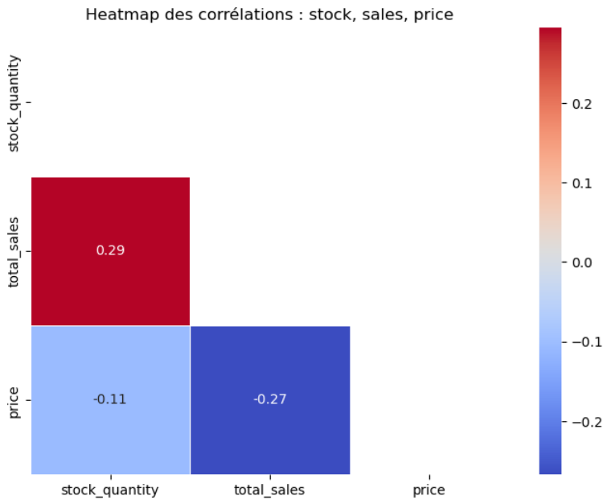
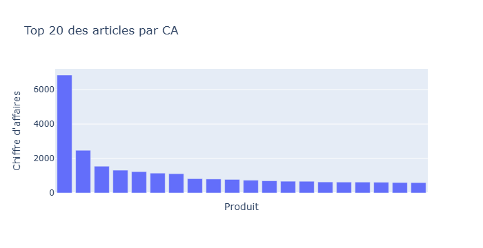
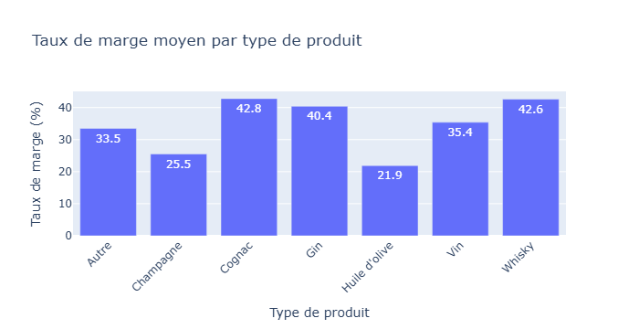

# Analyse-du-stock-et-des-ventes-d-un-site-e-commerce-de-vins-et-spiritueux

Python · Jupyter · Formation

Nettoyage et fusion de trois sources de données, puis analyse du chiffre d'affaires, des ventes, du stock et des marges du site BottleNeck, avec des pistes d'action pour piloter le catalogue.

## Contexte

Ce projet a été réalisé dans le cadre de ma formation de Data Analyst chez OpenClassrooms. La mission : analyser les ventes et le stock de BottleNeck, un site e-commerce de vins et spiritueux (vins, champagnes, whiskies, cognacs, gins, huile d'olive).

Les données proviennent de trois fichiers : l'ERP (prix, stock, prix d'achat), le site web (ventes, descriptions, dates) et une table de liaison entre les deux.

## Démarche

1. **Nettoyage de chaque source**
   - Contrôle de la cohérence entre quantité en stock et statut de stock (1 incohérence corrigée)
   - Correction des prix négatifs (valeur absolue) et des stocks négatifs (ramenés à 0)
   - Identification de 48 produits affichés en vente sur le site alors que leur stock est à 0, avec un point à discuter avec la boutique
   - Suppression de 7 colonnes sans information (valeur unique ou vide) dans le fichier web
   - Vérification de l'unicité des clés et des doublons

2. **Fusion des données**
   - Jointures entre ERP, table de liaison et fichier web
   - 714 produits sur 825 retenus, c'est-à-dire ceux présents à la fois dans l'ERP et sur le site

3. **Analyse univariée des prix**
   - Détection des valeurs aberrantes par deux méthodes : z-score et intervalle interquartile (boîte à moustaches)
   - Environ 4,5 % de produits au-delà du seuil d'outlier (environ 83 €), qui correspondent à des bouteilles de prestige et non à des erreurs

4. **Analyse du CA, des ventes, du stock et des marges**
   - Palmarès par CA et par quantités vendues, analyse de Pareto
   - Nombre de mois de stock, valorisation du stock
   - Taux de marge par type de produit
   - Corrélations entre prix, ventes et stock

## Résultats

- Un chiffre d'affaires cumulé d'environ **153 700 €** sur le périmètre analysé
- Un catalogue très concentré : **4,6 % des articles réalisent 80 % du CA**, et **7,9 % des produits réalisent 80 % des ventes**
- Un stock valorisé à environ **495 000 €**, pour près de **16 700 articles** en stock. Certains articles représentent jusqu'à 31 mois de stock.
- Un **taux de marge moyen de 35 %**, avec des écarts selon le type de produit
- Les articles chers se vendent moins, et les ventes sont corrélées au stock disponible, alors que le stock est indépendant du prix

## Aller plus loin : analyses complémentaires

Au-delà du nettoyage et des indicateurs de base, j'ai ajouté plusieurs analyses :

- **Contrôle de robustesse des données** : corrélation prix de vente / prix d'achat (r ≈ 0,97) pour vérifier la fiabilité du jeu de données, et détection d'**un produit à marge négative** (prix de vente de 12,65 € pour un prix d'achat de 77,48 €), très probablement une erreur de saisie.
- **Double détection des valeurs aberrantes** (z-score et IQR), avec une réflexion sur le caractère légitime des prix extrêmes plutôt qu'une suppression automatique.
- **Pilotage du stock** : mois de stock par produit et valorisation, pour repérer les références à faible rotation.
- **Finalisation du nettoyage du fichier web** : conversion des dates et heures, des booléens et des types, et nettoyage des descriptions HTML avec BeautifulSoup.

## Réalisations

**Corrélations entre stock, ventes et prix (Python)**

```python
df_corr = df[['stock_quantity', 'total_sales', 'price']]
corr = df_corr.corr()

# Demi-heatmap pour la lisibilité
mask = np.triu(np.ones_like(corr, dtype=bool))
sns.heatmap(corr, mask=mask, annot=True, cmap='coolwarm',
            linewidths=.5, fmt=".2f")
```


*Corrélations entre stock, ventes et prix*


*Top 20 des articles par chiffre d'affaires*


*Taux de marge moyen par type de produit*

## Perspectives

- Finaliser le nettoyage et la conversion des types
- Automatiser le retraitement des données dans un programme Python
- Mettre ce programme en production pour une analyse mensuelle

## Stack

`Python` · `pandas` · `seaborn` · `plotly` · `scipy` · `Jupyter`

[Voir le projet complet sur GitHub →]()
[Retour à la liste de projets →]()
